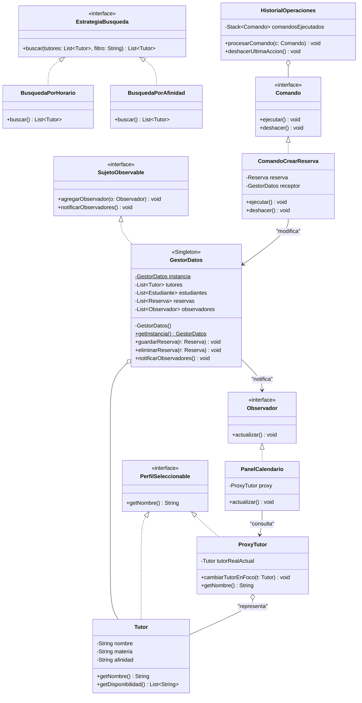

```mermaid
classDiagram
    direction TB

    %% --- PATRÓN OBSERVER (Sincronización GUI/Lógica) ---
    class Observador {
        <<interface>>
        +actualizar() void
    }
    
    class SujetoObservable {
        <<interface>>
        +agregarObservador(o: Observador) void
        +notificarObservadores() void
    }

    %% --- MODELO (Bastián) ---
    class GestorDatos {
        <<Singleton>>
        -GestorDatos instancia$
        -List~Tutor~ tutores
        -List~Estudiante~ estudiantes
        -List~Reserva~ reservas
        -List~Observador~ observadores
        -GestorDatos()
        +getInstancia() GestorDatos$
        +guardarReserva(r: Reserva) void
        +eliminarReserva(r: Reserva) void
        +notificarObservadores() void
    }

    class Tutor {
        -String nombre
        -String materia
        -String afinidad
        +getNombre() String
        +getDisponibilidad() List~String~
    }

    %% --- PATRÓN STRATEGY (Bastián) ---
    class EstrategiaBusqueda {
        <<interface>>
        +buscar(tutores: List~Tutor~, filtro: String) List~Tutor~
    }
    
    class BusquedaPorHorario {
        +buscar() List~Tutor~
    }
    
    class BusquedaPorAfinidad {
        +buscar() List~Tutor~
    }

    %% --- PATRÓN COMMAND (María José) ---
    class Comando {
        <<interface>>
        +ejecutar() void
        +deshacer() void
    }

    class ComandoCrearReserva {
        -Reserva reserva
        -GestorDatos receptor
        +ejecutar() void
        +deshacer() void
    }

    class HistorialOperaciones {
        -Stack~Comando~ comandosEjecutados
        +procesarComando(c: Comando) void
        +deshacerUltimaAccion() void
    }

    %% --- PATRÓN PROXY & VISTA (Tomás) ---
    class PerfilSeleccionable {
        <<interface>>
        +getNombre() String
    }

    class ProxyTutor {
        -Tutor tutorRealActual
        +cambiarTutorEnFoco(t: Tutor) void
        +getNombre() String
    }

    class PanelCalendario {
        -ProxyTutor proxy
        +actualizar() void
    }

    %% --- RELACIONES ---
    SujetoObservable <|.. GestorDatos
    GestorDatos o-- Tutor
    EstrategiaBusqueda <|.. BusquedaPorHorario
    EstrategiaBusqueda <|.. BusquedaPorAfinidad
    Comando <|.. ComandoCrearReserva
    HistorialOperaciones o-- Comando
    ComandoCrearReserva --> GestorDatos : "modifica"
    PerfilSeleccionable <|.. Tutor
    PerfilSeleccionable <|.. ProxyTutor
    ProxyTutor o-- Tutor : "representa"
    Observador <|.. PanelCalendario
    GestorDatos --> Observador : "notifica"
    PanelCalendario --> ProxyTutor : "consulta"
```
