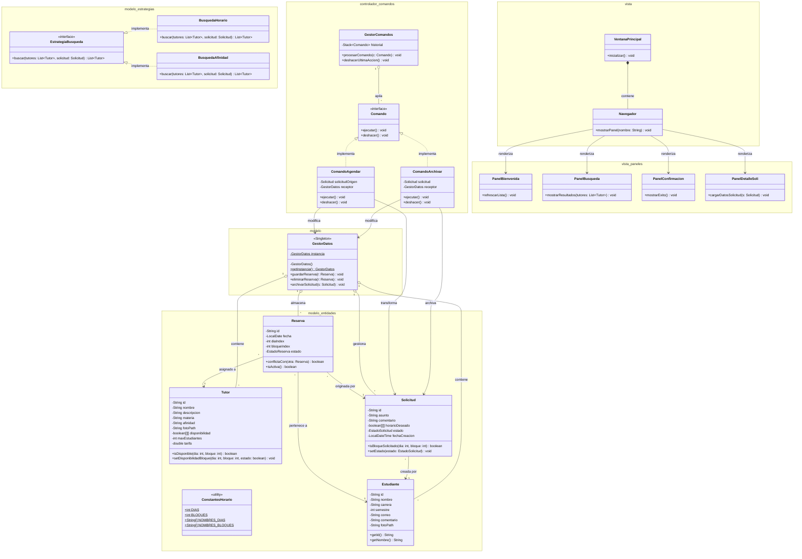

# Proyecto Semestral: Sistema de Reservas de Clases Particulares

## 1. Información del Equipo
* **Número de Grupo:** [15]
* **Integrantes:**
  * Bastián Antonio Pérez Aguayo
  * Tomás Francisco Garrido Fierro
  * María José Norambuena Meza

## 2. Enunciado del Proyecto
El presente proyecto consiste en el diseño e implementación de un sistema de reservas de tutorías académicas. La plataforma permite a los estudiantes emitir solicitudes de apoyo en materias específicas, declarando su disponibilidad horaria y necesidades particulares. A su vez, el sistema gestiona un catálogo de tutores con perfiles detallados, afinidades temáticas y matrices de disponibilidad semanal.

El objetivo central del software es dotar a un administrador de las herramientas lógicas e interfaces gráficas necesarias para emparejar estas solicitudes con los tutores más idóneos, previniendo conflictos de horario mediante una arquitectura robusta, y permitiendo la gestión transaccional (agendar, deshacer, archivar) de las clases particulares.

## 3. Patrones de Diseño Implementados

### 3.1. Singleton
* **Justificación:** Se requería un punto de acceso global y único a la base de datos en memoria del sistema para garantizar la consistencia de la información. Al mantener una única instancia, se centraliza la prevención de solapamientos horarios y se asegura que la Vista y los Comandos operen exactamente sobre el mismo estado.
* **Clases involucradas:** `GestorDatos`.

### 3.2. Strategy
* **Justificación:** El administrador necesita buscar tutores utilizando distintos criterios (por coincidencia de bloques horarios o por afinidad temática) de manera intercambiable. Este patrón permite aislar los algoritmos de filtrado, evitando condicionales complejos y facilitando la futura incorporación de nuevos criterios de búsqueda sin modificar el buscador central.
* **Clases involucradas:** `EstrategiaBusqueda` (Interfaz), `BusquedaHorario`, `BusquedaAfinidad`.

### 3.3. Command
* **Justificación:** Se implementó para encapsular las acciones administrativas (como agendar una tutoría) en objetos independientes. Esto desacopla a los botones de la interfaz gráfica de la lógica de negocio y habilita la funcionalidad exigida de "Deshacer/Rehacer" (Ctrl+Z), manteniendo un historial de transacciones seguro.
* **Clases involucradas:** `Comando` (Interfaz), `ComandoCrearReserva`, `ComandoDeshacerReserva`, `GestorComandos`.

### 3.4. Proxy & Observer
* **Justificación:** Para conectar la interfaz gráfica (Swing) con la capa de datos sin romper el encapsulamiento del Modelo de Dominio, se utilizó un Proxy que implementa una interfaz de solo lectura. Además, se combinó con el patrón Observer para que la Vista reaccione automáticamente a los cambios de estado (como actualizaciones en la grilla horaria).
* **Clases involucradas:** `PerfilSeleccionable` (Interfaz), `ProxyTutor`, `SujetoObservable`, `Observador`.

## 4. Decisiones Importantes y Mejoras a la Temática Central
Durante el desarrollo de la arquitectura, el equipo tomó decisiones clave para garantizar la escalabilidad y robustez del sistema:
* **Modelamiento Matricial del Horario:** En lugar de utilizar fechas complejas para la disponibilidad, se implementó una matriz `boolean[5][6]` (días y bloques) estandarizada mediante `ConstantesHorario`. Esto redujo drásticamente la complejidad computacional del patrón Strategy a O(1) en las búsquedas.
* **Afinidad Implícita (Heurística):** Dado que los estudiantes declaran una carrera y los tutores una especialidad general, se incorporó un motor de inferencia en `BusquedaAfinidad` que clasifica automáticamente palabras clave (ej. "Ingeniería" -> "Ciencias Exactas") para hacer el emparejamiento mucho más orgánico y útil.
* **Protección de Invariantes (Copias Defensivas):** Se determinó que ninguna clase del modelo debe retornar referencias directas a sus arreglos internos. Entidades como `Tutor` y `Solicitud` generan copias profundas de sus matrices, garantizando que un panel de la Vista nunca pueda corromper el estado del modelo accidentalmente.

## 5. Problemas Identificados y Autocrítica
A lo largo del ciclo de vida del desarrollo, el equipo enfrentó desafíos tanto técnicos como de coordinación:
* **Colisiones en la Integración Continua (Git):** [Aquí pueden explayarse sobre los conflictos de merge. Por ejemplo: "Al trabajar en ramas paralelas (`feature/modelo-estrategias`, `feature/vista-proxy`), enfrentamos solapamientos lógicos, como la creación de excepciones redundantes (`ConflictoHorarioException` vs `HorarioOcupadoException`). Esto evidenció la necesidad de mejorar la comunicación técnica antes de integrar ramas hacia `main`."]
* **Acoplamiento Inicial Vista-Modelo:** [Por ejemplo: "Inicialmente costó definir cómo la UI leería los datos sin acoplarse a `GestorDatos`. La implementación tardía de la interfaz `PerfilSeleccionable` retrasó ligeramente el ensamblaje visual."]
* **Autocrítica:** [Por ejemplo: "Como equipo, logramos un excelente diseño algorítmico y cobertura de pruebas unitarias (JUnit 5), pero pudimos haber definido los contratos de las interfaces (como las firmas del patrón Command) de forma más estricta en las reuniones de planificación para evitar refactorizaciones de última hora."]

## 6. Diagrama UML del proyecto

