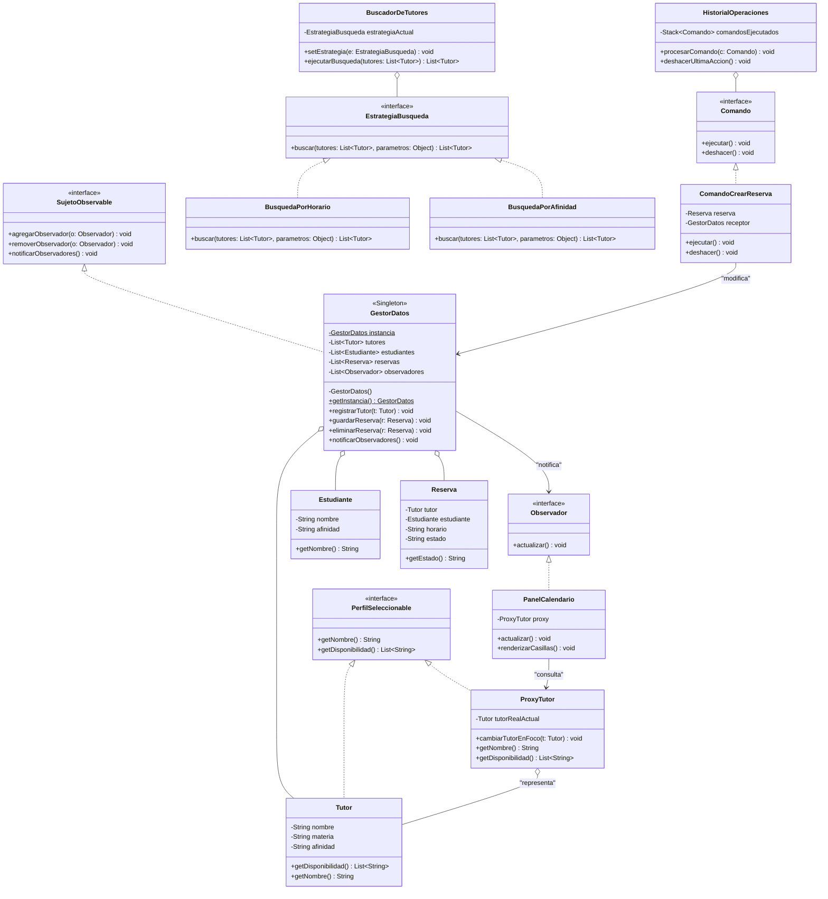

```mermaid
classDiagram
    %% ==========================================
    %% PATRÓN OBSERVER (Interfaces Base)
    %% ==========================================
    class Observador {
        <<interface>>
        +actualizar() void
    }
    
    class SujetoObservable {
        <<interface>>
        +agregarObservador(o: Observador) void
        +removerObservador(o: Observador) void
        +notificarObservadores() void
    }

    %% ==========================================
    %% MODELO (Lógica, Datos y Singleton)
    %% ==========================================
    class GestorDatos {
        <<Singleton>>
        -GestorDatos instancia$
        -List~Tutor~ tutores
        -List~Estudiante~ estudiantes
        -List~Reserva~ reservas
        -List~Observador~ observadores
        -GestorDatos()
        +getInstancia() GestorDatos$
        +registrarTutor(t: Tutor) void
        +guardarReserva(r: Reserva) void
        +eliminarReserva(r: Reserva) void
        +notificarObservadores() void
    }

    class Tutor {
        -String nombre
        -String materia
        -String afinidad
        +getDisponibilidad() List~String~
        +getNombre() String
    }
    
    class Estudiante {
        -String nombre
        -String afinidad
        +getNombre() String
    }

    class Reserva {
        -Tutor tutor
        -Estudiante estudiante
        -String horario
        -String estado
        +getEstado() String
    }

    SujetoObservable <|.. GestorDatos
    GestorDatos o-- Tutor
    GestorDatos o-- Estudiante
    GestorDatos o-- Reserva

    %% ==========================================
    %% PATRÓN STRATEGY (Algoritmos)
    %% ==========================================
    class EstrategiaBusqueda {
        <<interface>>
        +buscar(tutores: List~Tutor~, parametros: Object) List~Tutor~
    }
    
    class BusquedaPorHorario {
        +buscar(tutores: List~Tutor~, parametros: Object) List~Tutor~
    }
    
    class BusquedaPorAfinidad {
        +buscar(tutores: List~Tutor~, parametros: Object) List~Tutor~
    }

    class BuscadorDeTutores {
        -EstrategiaBusqueda estrategiaActual
        +setEstrategia(e: EstrategiaBusqueda) void
        +ejecutarBusqueda(tutores: List~Tutor~) List~Tutor~
    }

    EstrategiaBusqueda <|.. BusquedaPorHorario
    EstrategiaBusqueda <|.. BusquedaPorAfinidad
    BuscadorDeTutores o-- EstrategiaBusqueda

    %% ==========================================
    %% CONTROLADOR & PATRÓN COMMAND
    %% ==========================================
    class Comando {
        <<interface>>
        +ejecutar() void
        +deshacer() void
    }

    class ComandoCrearReserva {
        -Reserva reserva
        -GestorDatos receptor
        +ejecutar() void
        +deshacer() void
    }

    class HistorialOperaciones {
        -Stack~Comando~ comandosEjecutados
        +procesarComando(c: Comando) void
        +deshacerUltimaAccion() void
    }

    Comando <|.. ComandoCrearReserva
    HistorialOperaciones o-- Comando
    ComandoCrearReserva --> GestorDatos : "modifica"

    %% ==========================================
    %% VISTA & PATRÓN PROXY
    %% ==========================================
    class PerfilSeleccionable {
        <<interface>>
        +getNombre() String
        +getDisponibilidad() List~String~
    }

    class ProxyTutor {
        -Tutor tutorRealActual
        +cambiarTutorEnFoco(t: Tutor) void
        +getNombre() String
        +getDisponibilidad() List~String~
    }

    class PanelCalendario {
        -ProxyTutor proxy
        +actualizar() void
        +renderizarCasillas() void
    }

    PerfilSeleccionable <|.. Tutor
    PerfilSeleccionable <|.. ProxyTutor
    ProxyTutor o-- Tutor : "representa"
    Observador <|.. PanelCalendario
    GestorDatos --> Observador : "notifica"
    PanelCalendario --> ProxyTutor : "consulta"
```
