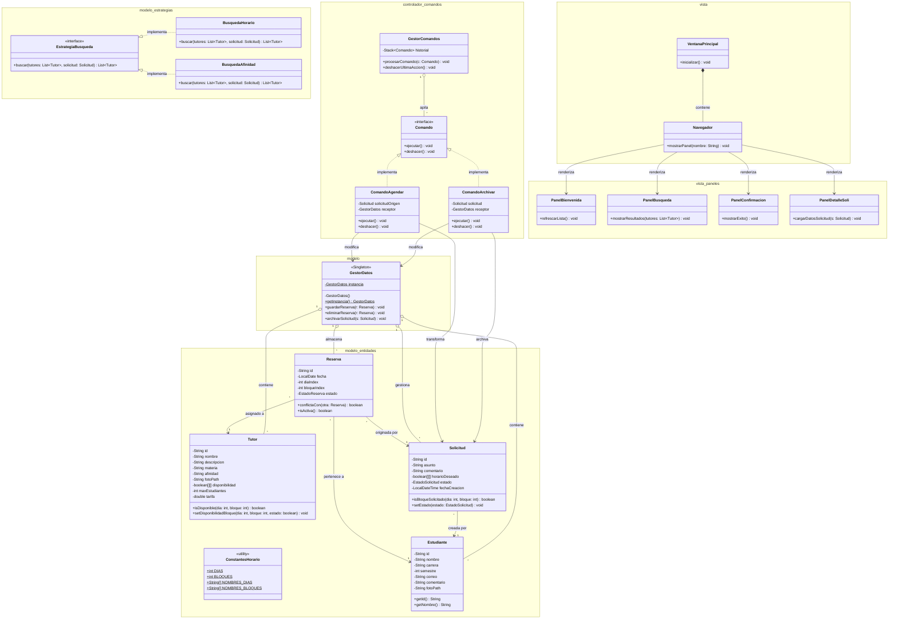

```mermaid
classDiagram
    direction TB

    %% ==========================================
    %% PAQUETE: modelo.entidades
    %% ==========================================
    namespace modelo_entidades {
        class ConstantesHorario {
            <<utility>>
            +int DIAS$
            +int BLOQUES$
            +String[] NOMBRES_DIAS$
            +String[] NOMBRES_BLOQUES$
        }

        class Estudiante {
            -String id
            -String nombre
            -String carrera
            -int semestre
            -String correo
            -String comentario
            -String fotoPath
            +getId() String
            +getNombre() String
        }

        class Tutor {
            -String id
            -String nombre
            -String descripcion
            -String materia
            -String afinidad
            -String fotoPath
            -boolean[][] disponibilidad
            -int maxEstudiantes
            -double tarifa
            +isDisponible(dia: int, bloque: int) boolean
            +setDisponibilidadBloque(dia: int, bloque: int, estado: boolean) void
        }

        class Solicitud {
            -String id
            -String asunto
            -String comentario
            -boolean[][] horarioDeseado
            -EstadoSolicitud estado
            -LocalDateTime fechaCreacion
            +isBloqueSolicitado(dia: int, bloque: int) boolean
            +setEstado(estado: EstadoSolicitud) void
        }

        class Reserva {
            -String id
            -LocalDate fecha
            -int diaIndex
            -int bloqueIndex
            -EstadoReserva estado
            +conflictaCon(otra: Reserva) boolean
            +isActiva() boolean
        }
    }

    %% ==========================================
    %% PAQUETE: modelo
    %% ==========================================
    namespace modelo {
        class GestorDatos {
            <<Singleton>>
            -GestorDatos instancia$
            -GestorDatos()
            +getInstancia() GestorDatos$
            +guardarReserva(r: Reserva) void
            +eliminarReserva(r: Reserva) void
            +archivarSolicitud(s: Solicitud) void
        }
    }

    %% ==========================================
    %% PAQUETE: modelo.estrategias
    %% ==========================================
    namespace modelo_estrategias {
        class EstrategiaBusqueda {
            <<interface>>
            +buscar(tutores: List~Tutor~, solicitud: Solicitud) List~Tutor~
        }
        class BusquedaHorario {
            +buscar(tutores: List~Tutor~, solicitud: Solicitud) List~Tutor~
        }
        class BusquedaAfinidad {
            +buscar(tutores: List~Tutor~, solicitud: Solicitud) List~Tutor~
        }
    }

    %% ==========================================
    %% PAQUETE: controlador.comandos
    %% ==========================================
    namespace controlador_comandos {
        class Comando {
            <<interface>>
            +ejecutar() void
            +deshacer() void
        }
        class ComandoAgendar {
            -Solicitud solicitudOrigen
            -GestorDatos receptor
            +ejecutar() void
            +deshacer() void
        }
        class ComandoArchivar {
            -Solicitud solicitud
            -GestorDatos receptor
            +ejecutar() void
            +deshacer() void
        }
        class GestorComandos {
            -Stack~Comando~ historial
            +procesarComando(c: Comando) void
            +deshacerUltimaAccion() void
        }
    }

    %% ==========================================
    %% PAQUETES: vista y vista.paneles
    %% ==========================================
    namespace vista {
        class VentanaPrincipal {
            +inicializar() void
        }
        class Navegador {
            +mostrarPanel(nombre: String) void
        }
    }
    
    namespace vista_paneles {
        class PanelBienvenida {
            +refrescarLista() void
        }
        class PanelBusqueda {
            +mostrarResultados(tutores: List~Tutor~) void
        }
        class PanelConfirmacion {
            +mostrarExito() void
        }
        class PanelDetalleSoli {
            +cargarDatosSolicitud(s: Solicitud) void
        }
    }

    %% ==========================================
    %% RELACIONES UML (Estructurales y Comportamiento)
    %% ==========================================
    
    %% Relaciones de Entidades
    Reserva "*" --> "1" Tutor : asignado a
    Reserva "*" --> "1" Estudiante : pertenece a
    Reserva "*" --> "1" Solicitud : originada por
    Solicitud "*" --> "1" Estudiante : creada por

    %% Relaciones de Agregación del Singleton
    GestorDatos "1" o-- "*" Tutor : contiene
    GestorDatos "1" o-- "*" Estudiante : contiene
    GestorDatos "1" o-- "*" Solicitud : gestiona
    GestorDatos "1" o-- "*" Reserva : almacena

    %% Implementación Patrón Strategy
    EstrategiaBusqueda <|.. BusquedaHorario : implementa
    EstrategiaBusqueda <|.. BusquedaAfinidad : implementa
    
    %% Implementación Patrón Command
    Comando <|.. ComandoAgendar : implementa
    Comando <|.. ComandoArchivar : implementa
    GestorComandos "1" o-- "*" Comando : apila
    
    %% Dependencias de Controladores hacia Modelo
    ComandoAgendar --> GestorDatos : modifica
    ComandoArchivar --> GestorDatos : modifica
    ComandoAgendar --> Solicitud : transforma
    ComandoArchivar --> Solicitud : archiva

    %% Relaciones de Composición en la Vista
    VentanaPrincipal *-- Navegador : contiene
    Navegador --> PanelBienvenida : renderiza
    Navegador --> PanelBusqueda : renderiza
    Navegador --> PanelConfirmacion : renderiza
    Navegador --> PanelDetalleSoli : renderiza
```
